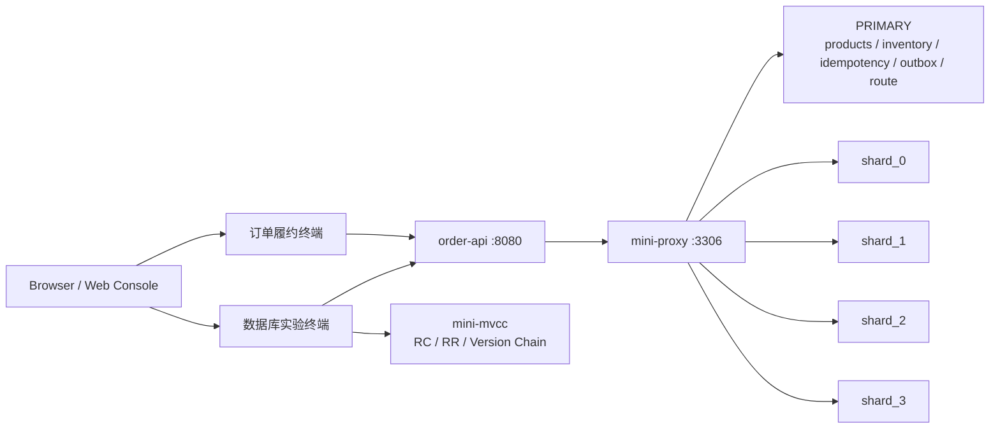
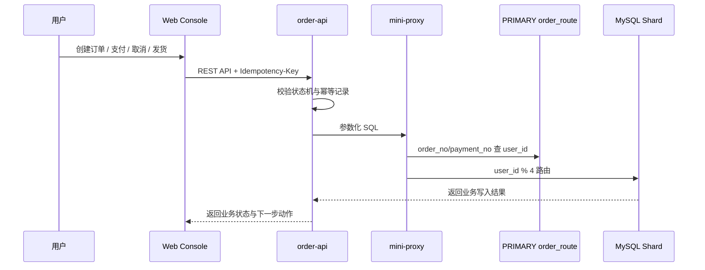

# MiniDB-Lab / sql_demo


## 项目简介

MiniDB-Lab 是一个用订单履约业务验证 MVCC、MySQL 协议代理、分片路由、事务一致性和数据库可观测能力的教学型数据库工程实验平台。

项目类型：数据库工程实验平台 / 后端服务原型 / Web 控制台项目。

本项目不是生产级数据库，也不是完整电商系统。它通过“创建订单、扣库存、支付回调、履约发货”等真实业务场景，帮助学习者和后端开发者理解数据库内部机制、中间件路由逻辑以及业务一致性风险。

当前仓库已建立 Maven 多模块工程、自动验证脚本、订单履约 API、MySQL 协议代理、自研 MVCC 实验引擎和 React Web 控制台。Web 控制台按职责拆分为订单履约终端和数据库实验终端，二者通过真实订单链路关联，但界面和用户路径保持独立。

v7 阶段开始，项目推进方式调整为”整体目标导向”：先把用户行为路径、状态反馈、接口数据结构、数据库设计、可观测证据、对标取舍和阶段验收标准补齐，再按阶段逐次推进。所有后续阶段均在 v7 分支内完成，按项目阶段编号区分。详细设计记录在本地文档 `doc/14_v7_整体设计补齐与落地验收.md`，该目录按项目规则不提交远端。


## 核心功能

- 简易 MVCC 事务管理器：演示事务 ID、版本链、Undo Log、Read View、Read Committed 与 Repeatable Read 的差异。
- 简易 MySQL 协议代理：支持 MySQL 握手、`COM_QUERY`、SQL 转发、连接池、读写分离、事务绑定和分片路由。
- 订单履约业务验证：覆盖创建订单、库存扣减、支付回调、取消订单、履约发货、幂等和异常补偿。
- 分片路由实验：按 `user_id` 进行单分片路由，通过 `order_no` / `payment_no` 查路由表后定位用户分片，拒绝缺少分片键的高风险查询。
- 数据库实验观测台：展示 SQL 路由、事务上下文、幂等记录、Outbox 事件和 MVCC 版本链。
- 工程约束验证：通过测试、迁移脚本、状态机和审计记录保证关键逻辑可验证、可回溯。


## 技术栈

| 分类 | 技术 |
| --- | --- |
| 前端 | React、Ant Design Pro / ProComponents |
| 后端 | Java 17、Spring Boot、Netty |
| 数据库 | MySQL InnoDB |
| 数据库迁移 | Flyway |
| SQL 解析 | Druid SQL Parser，后续可评估 Apache Calcite |
| 测试 | JUnit 5、Testcontainers、Vitest |
| 接口文档 | OpenAPI |
| 可观测 | OpenTelemetry、Micrometer、Spring Boot Actuator |
| 构建工具 | Maven、npm |
| 其他 | Docker、GitHub Actions |


## 项目架构

整体架构围绕三条主线展开：数据库原理实验、中间件代理实验、订单履约业务验证。

```text
Browser / Web Console
        |
        v
order-api ---------------> MySQL InnoDB
   |                             ^
   |                             |
   v                             |
mini-mvcc                 mini-proxy
事务可见性实验              MySQL 协议代理 / 路由 / 连接池
```

更完整的运行关系如下：



### 模块目录与功能

| 目录 | 功能 |
| --- | --- |
| `mini-mvcc/` | 简易 MVCC 实验引擎，负责事务可见性、版本链、Undo Log、Read View、隔离级别和写冲突演示 |
| `mini-proxy/` | 简易 MySQL 协议代理，负责握手、`COM_QUERY`、SQL 转发、读写分离、分片路由、连接池和事务绑定 |
| `order-api/` | 订单履约业务 API，负责订单、库存、支付、履约、取消、幂等、Outbox 和异常工单 |
| `web-console/` | React Web 控制台，包含订单履约终端和数据库实验终端 |
| `tools/` | 本地自动化验证脚本，统一检查环境、项目结构、构建、测试、lint 和 Git 忽略策略 |
| `logs/` | 本地运行日志目录，仅保留说明文件，日志文件不进入版本控制 |
| `.github/workflows/` | GitHub Actions CI，使用 JDK 17 执行严格验证 |


### 核心链路

```text
创建订单
  -> 幂等检查
  -> 库存条件扣减
  -> 写订单与订单明细
  -> 写库存流水
  -> 写 Outbox 事件
  -> 写 order_route 路由记录
  -> 返回订单结果
```

```text
SQL 请求
  -> mini-proxy 接收 MySQL 协议包
  -> SQL Parser 提取表、类型和分片键
  -> Router 判断 PRIMARY / 分片
  -> Backend Pool 借用连接
  -> MySQL 返回结果集
```




## 快速开始

环境检查：

```bash
java -version
mvn -version
docker --version
mysql --version
node --version
npm --version
```

运行本地自动验证：

```bash
python tools/verify_local.py
python tools/verify_local.py verify

后端：

order-api：http://127.0.0.1:8080
订单履约终端：http://127.0.0.1:5173/business/dashboard
```

严格模式用于 CI 或完整环境：

```bash
python tools/verify_local.py --strict
```

统一工程维护命令：

```bash
# 预演清理 Maven target/ 和前端 dist/，不实际删除
python tools/verify_local.py clean

# 执行清理，仅限白名单构建产物目录
python tools/verify_local.py clean --apply

# 检查日志大小和同名前缀日志数量，默认限制 20 MB、10 个文件
python tools/verify_local.py log-check

# 自定义日志约束；超出数量的旧日志加 --apply 后归档到 logs/archive/
python tools/verify_local.py log-check --max-log-size-mb 20 --max-log-files 10
python tools/verify_local.py log-check --apply
```

后端构建与测试：

```bash
mvn -B verify
mvn -pl mini-mvcc test
mvn -pl mini-proxy test
mvn -pl order-api test
```

后端服务启动：

```bash
mvn -f order-api/pom.xml org.springframework.boot:spring-boot-maven-plugin:3.2.5:test-run -Dspring-boot.run.profiles=test
```

前端启动：

```bash
cd web-console
npm install
npm run dev
```

数据库迁移：

```bash
mvn -pl order-api flyway:migrate
mvn -pl order-api flyway:info
```


### 本地访问地址

| 页面 / 服务 | 地址 |
| --- | --- |
| 订单履约终端 | `http://127.0.0.1:5173/business/dashboard` |
| 订单队列 | `http://127.0.0.1:5173/business/orders` |
| 履约工作台 | `http://127.0.0.1:5173/business/fulfillment` |
| 异常中心 | `http://127.0.0.1:5173/business/exceptions` |
| 数据库实验终端 | `http://127.0.0.1:5173/database/lab` |
| 链路追踪 | `http://127.0.0.1:5173/database/trace` |
| order-api | `http://127.0.0.1:8080` |
| 健康检查 | `http://127.0.0.1:8080/actuator/health` |
| mini-proxy | `127.0.0.1:3306` |

加载演示订单：
OpenAPI/接口文档：http://localhost:8080/swagger-ui.html

运行模式接口：

```bash
curl http://localhost:8080/api/runtime/mode
```

```bash
curl -X POST http://127.0.0.1:8080/api/console/demo/load ^
  -H "Idempotency-Key: demo-orders-001"
```

## 环境变量

本地测试配置可以直接使用 `application-test.yml`。后续接入真实 MySQL、代理和分片时，建议使用以下配置项：

```env
DATABASE_URL=
DATABASE_USERNAME=
DATABASE_PASSWORD=
MINIDB_PROXY_PORT=3306
MINIDB_SHARD_COUNT=4
MINIDB_DEFAULT_ISOLATION=REPEATABLE_READ
MINIDB_CONSOLE_DEMO_ENABLED=true
MINIDB_BACKEND_HOST=127.0.0.1
MINIDB_BACKEND_PORT_BASE=4407
MINIDB_BACKEND_USERNAME=root
MINIDB_BACKEND_PASSWORD=
MINIDB_PRIMARY_DATABASE=minidb
MINIDB_REPLICA_DATABASE=minidb
MINIDB_SHARD_DATABASE_PREFIX=minidb_shard_
```

所有真实密钥、数据库密码和外部服务凭证不得提交到仓库。


## 项目结构

当前结构：

```text
sql_demo/
  README.md
  PROJECT_DESIGN.md
  pom.xml

  mini-mvcc/
    pom.xml
    src/main/java/com/minidb/mvcc/
    src/test/java/com/minidb/mvcc/

  mini-proxy/
    pom.xml
    src/main/java/com/minidb/proxy/
    src/test/java/com/minidb/proxy/

  order-api/
    pom.xml
    src/main/java/com/minidb/order/
    src/main/resources/db/migration/
    src/test/java/com/minidb/order/

  web-console/
    package.json
    src/

  tools/
    verify_local.py

  logs/
    README.md

  .github/workflows/
    ci.yml
```

## 使用说明

推荐按以下顺序理解和实现项目：

1. 先理解订单履约场景：创建订单、扣库存、支付成功、履约发货和取消订单。
2. 再理解 `mini-mvcc`：用内存 KV 演示 RC/RR、Undo Log、Read View 和版本链。
3. 再理解 `mini-proxy`：通过 MySQL 客户端连接代理并执行 SQL。
4. 然后理解订单单库闭环：所有写接口必须幂等，所有状态更新必须带原状态条件。
5. 最后接入代理和分片：按 `user_id % N` 路由订单相关 SQL。
6. 使用 Web 控制台分别验证业务动作和数据库观测，不把两类用户路径混成一个页面。


关键业务约束：

- 下单扣库存必须使用条件更新，不能依赖快照读。
- 支付回调必须验签、幂等、审计。
- 重复下单必须返回第一次处理结果。
- 缺少分片键的高风险查询必须拒绝。
- 数据库结构变更必须通过 Flyway 迁移脚本执行。

## 当前加固验收标准

本轮项目审查后的统一加固目标：

- MySQL 协议代理必须按官方协议处理客户端 `HandshakeResponse41`：用户名为 `NUL` 结尾字符串，认证响应按 capability 读取，数据库名和认证插件名也按 `NUL` 结尾字段解析。
- MySQL 协议代理必须按官方协议发送后端 `COM_QUERY`：包头为 `3-byte payload_length + 1-byte sequence_id`，命令阶段序号从 `0` 开始，payload 首字节为 `0x03`，后接 SQL 文本。
- `mini-proxy` 到后端 MySQL 必须显式指定后端库名，默认 `PRIMARY/REPLICA=minidb`、分片库名前缀 `minidb_shard_`，可通过 `MINIDB_PRIMARY_DATABASE`、`MINIDB_REPLICA_DATABASE`、`MINIDB_SHARD_DATABASE_PREFIX` 覆盖。
- `mini-proxy` 对访问分片表但缺少 `user_id`、`order_no` 或 `payment_no` 的读写 SQL 必须返回 `MISSING_SHARD_KEY`，只允许无表查询和 PRIMARY-only 控制表走默认路由。
- `order-api` 默认保持单库直连模式；如启用 `spring.profiles.active=proxy`，必须清楚知道控制台全局聚合、演示数据装载、仅按 `order_id` 的链路追踪不属于 proxy 分片安全查询，系统会拒绝这些查询。
- proxy 实验模式下，订单详情按 `order_id` 查询必须携带 `X-User-Id`；按 `order_no` 查询可通过 `order_route` 路由到单分片。前端订单列表进入详情时必须传递当前 `user_id`。
- 所有真实写接口必须消费 `Idempotency-Key`，业务失败要把幂等记录从 `PROCESSING` 标记为 `FAILED`，相同请求允许重试，不同请求必须拒绝。
- 履约发货必须检查任务状态、认领人、订单原状态和库存影响行数，任一条件不满足不得继续写订单、发货单或 outbox。
- `exception_tickets.detail`、`outbox_events.payload`、`idempotency_records.response_body` 必须写入合法 JSON 文本。
- Outbox 处理必须先用条件更新领取事件，再分发，避免多处理器重复处理同一条 `NEW` 事件。

对标依据：

- MySQL 官方协议文档：`HandshakeResponse41`、Command Phase、`COM_QUERY`。
- MySQL 8.4 官方认证文档：`mysql_native_password` 在 MySQL 8.4 默认禁用，参考 docker 环境如需 native auth 必须使用 `--mysql-native-password=ON`。
- ShardingSphere 路由约束：SQL 缺少分片条件时无法单分片路由。本项目选择拒绝高风险查询，而不是自动广播或跨分片 Join。

### 运行模式边界

本项目当前明确区分两种运行模式：

| 模式 | 用途 | 数据源 | 查询边界 |
| --- | --- | --- | --- |
| 单库直连模式（默认） | 订单闭环、控制台聚合、演示数据、H2/本地 MySQL 快速验证 | `application.yml` 中的 MySQL | 允许控制台全局聚合和按 `order_id` 查询 |
| proxy 实验模式 | 验证 MySQL 协议、分片键路由、缺键拒绝和事务绑定 | `application-proxy.yml`，连接 `mini-proxy` | 分片表必须携带 `user_id`、`order_no` 或 `payment_no` |

proxy 实验模式启动参考：

```bash
# 先启动或准备你自己的 MySQL 后端，再启动 mini-proxy
set MINIDB_BACKEND_HOST=127.0.0.1
set MINIDB_BACKEND_PORT_BASE=4407
set MINIDB_PRIMARY_DATABASE=minidb
set MINIDB_REPLICA_DATABASE=minidb
set MINIDB_SHARD_DATABASE_PREFIX=minidb_shard_
mvn -pl mini-proxy exec:java -Dexec.mainClass=com.minidb.proxy.MiniProxyServer

# order-api 经 proxy 访问，仅用于分片实验接口验证
mvn -f order-api/pom.xml spring-boot:run -Dspring-boot.run.profiles=proxy
```

proxy smoke 验收入口：

```bash
# 默认 dry-run，不连接数据库、不写数据
python tools/proxy_smoke.py

# 真实联调时显式执行网络检查
python tools/proxy_smoke.py --execute --json
```


本轮验收命令：

```bash
mvn -pl mini-proxy test
mvn -pl order-api test
npm --prefix web-console run lint
npm --prefix web-console run test
python tools/verify_local.py --json
```

## v7 后续阶段规划

v7 之后不再只按零散功能拆任务，而是按可验收阶段递进。所有阶段均在 v7 分支内完成；阶段内每实现一个功能就做最小测试，跑通后继续下一个功能。三轮 review 放在实际项目阶段结束后，分别检查交互闭环、数据一致性和工程可落地性；最终大阶段提交和推送前再由用户确认。

| 阶段 | 阶段目标 | 交付重点 | 验收重点 |
| --- | --- | --- | --- |
| 阶段七 | 整体认知与路线图 | 用户路径、状态流转、接口/数据/数据库设计、对标分析、工具规划 | 文档能指导后续实现，统一验证通过 |
| 阶段八 | 真实 MySQL/Proxy 联调 | Docker MySQL、mini-proxy、order-api proxy profile 最小链路 | MySQL client 经 proxy 跑通 `SELECT 1`、订单链路和缺键拒绝 |
| 阶段九 | 数据库链路观测 | session、连接池、路由决策、SQL audit、Trace 页面 | 一笔订单能解释 SQL、路由、事务、幂等和 outbox |
| 阶段十 | 业务交互闭环 | 异常详情、取消确认、发货表单、空状态/错误态 | 用户每一步知道状态变化、成功反馈和失败原因 |
| 阶段十一 | MVCC 实验台增强 | 自定义场景、版本链图形化、断言输出 | RC/RR、回滚、写冲突可复现可解释 |
| 阶段十二 | 工程化收口 | CI、Testcontainers、OpenAPI 契约、安全审计 | 全量 verify、真实集成 smoke 和前端浏览器验收通过 |

## 部署说明

暂无正式部署方式。

本地开发部署形态：

```text
web-console   :5173
order-api     :8080
mini-proxy    :3306
mysql-primary :PRIMARY
mysql-shard-0 :shard_0
mysql-shard-1 :shard_1
mysql-shard-2 :shard_2
mysql-shard-3 :shard_3
```

MVP 阶段优先本地运行和 CI 验证，不依赖 Kubernetes、云服务或真实支付渠道。

## License

暂无。
